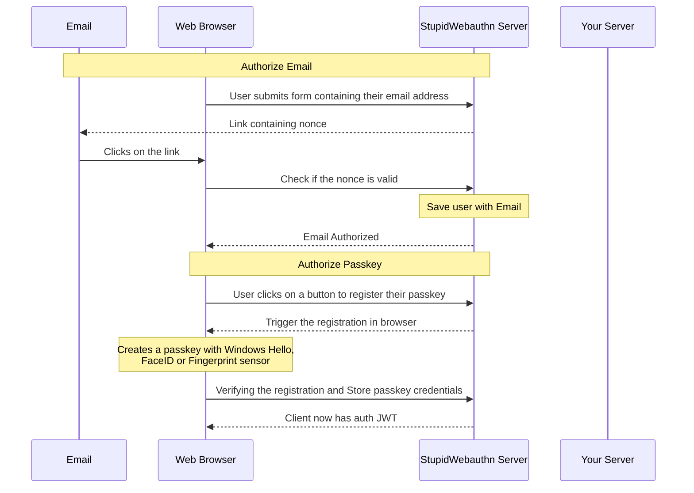
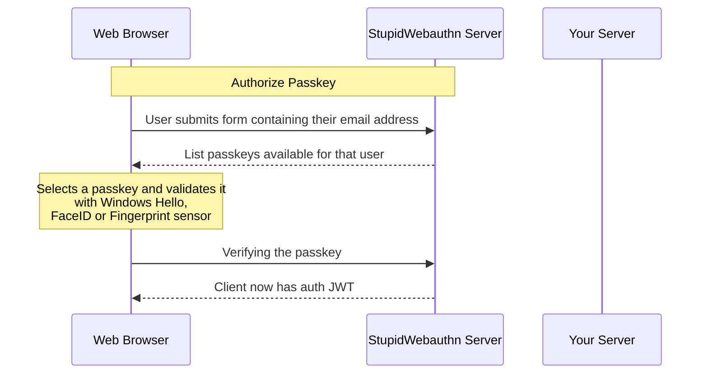
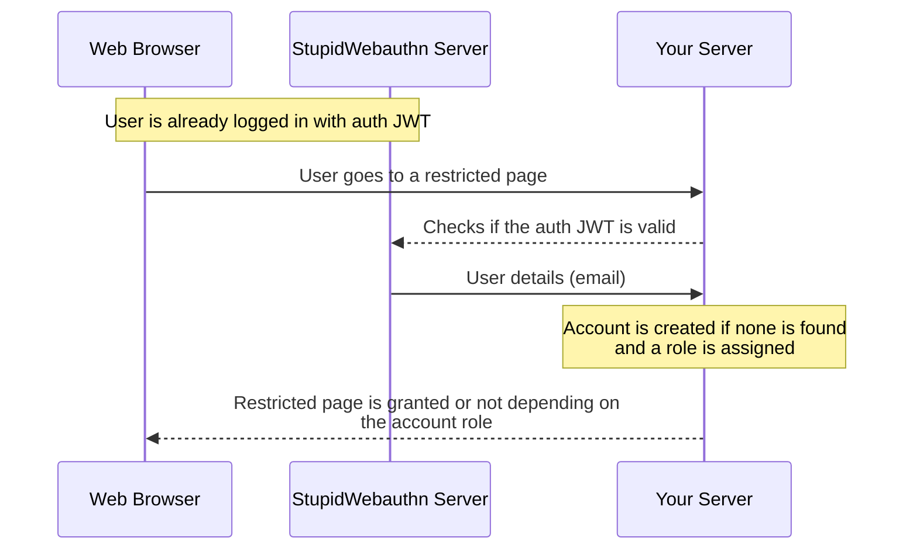
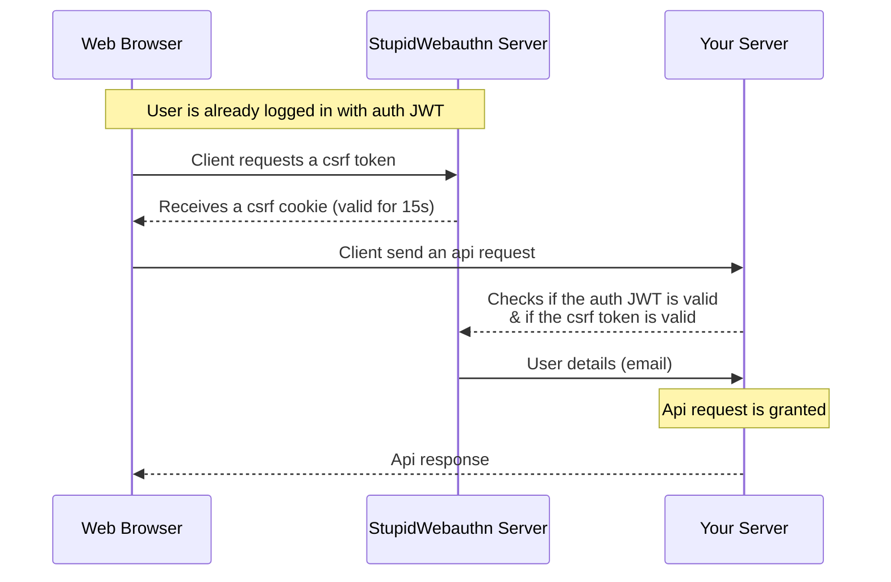
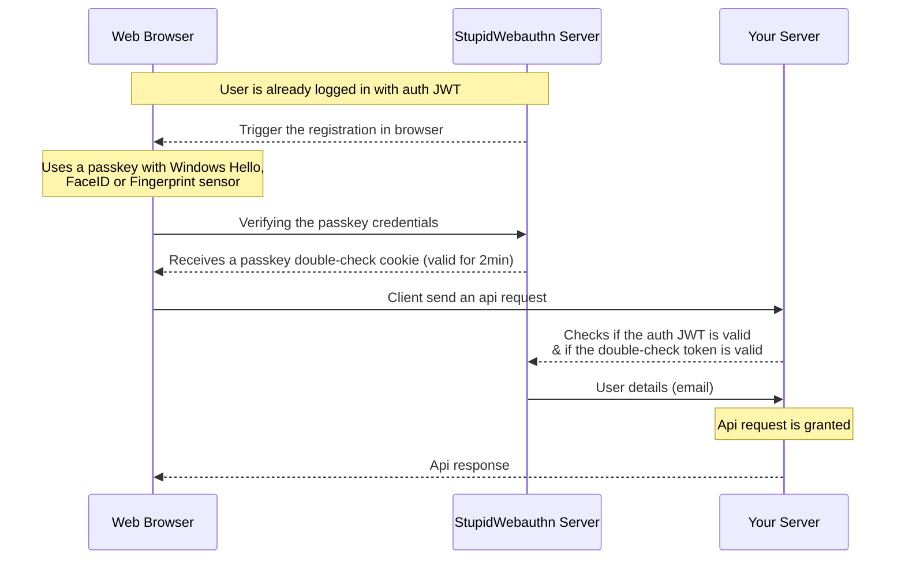

# What is Stupid Webauthn?

A simple, [Open Source](https://github.com/stupidwebauthn/server/blob/main/LICENSE), web service that provides Passkey authentication for your websites.

1. Send emails to verify
1. Create passkeys to authenticate
1. \_\_

I found many alternative use Passkeys as a 2nd factor authentication on top of passwords, I'm trying to make this as simple as possible to get started: [Getting Started](/docs/getting-started)

## How would users interact with this?

:::info

While Stupid Webauthn handles the authentication, it does not handle authorization (user&nbsp;roles), this is instead left to your server to handle.

:::

### Registration

### Login

### Your server authorization

#### Webpage authentication

#### Api call authentication with csrf

#### Api call authentication with passkey check

